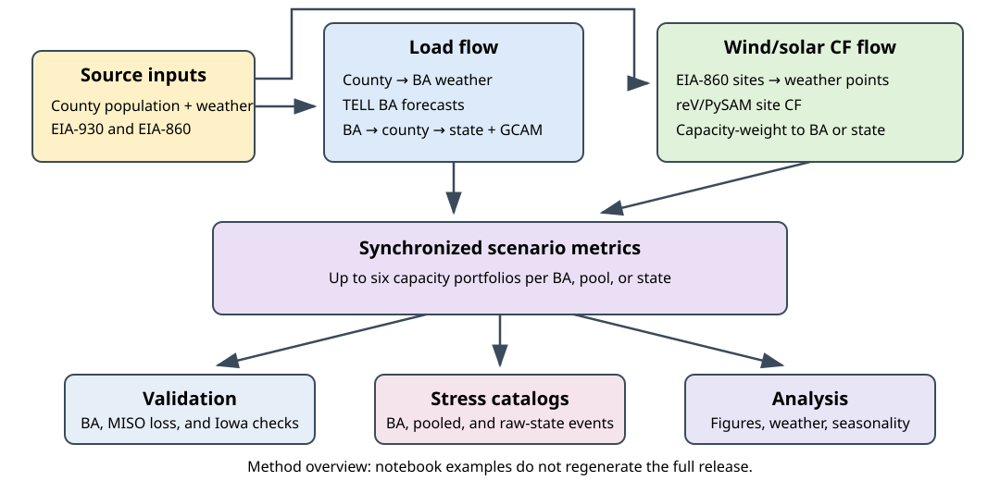

# Synchronized Wind, Solar, and Load Data for Power System Planning

## Overview

These 18 notebooks explain and evaluate synchronized hourly weather, modeled
electricity demand, and wind and solar capacity factors (CF) for power-system
planning. They show how these inputs produce renewable scenarios, net-load
time series, and stress-event catalogs. Saved tables and figures can be read
directly on GitHub.

## Notebook index

Each notebook states its inputs, assumptions, and calculations. Results appear
inline; exported files go to `data_outputs/`.

### Data flow — 9 notebooks

| Notebook | Inputs / requirements | Outputs |
| --- | --- | --- |
| [County weather-point selection](notebooks/data_flow/county_weather_point_selection.ipynb) | Arthur County Census inputs; HSDS. | Population-weighted point and weather-grid IDs. |
| [County weather and BA aggregation](notebooks/data_flow/county_hsds_download_and_ba_weather_aggregation.ipynb) | County mappings/population; HSDS if uncached. | One-hour MISO weather and Iowa aggregation example. |
| [TELL load forecasting](notebooks/data_flow/tell_load_forecast_data_flow.ipynb) | MISO weather/load; TELL. | Model training, forecasts, and held-out 2023 validation. |
| [EIA-860 regridding](notebooks/data_flow/eia860_regridding_methodology.ipynb) | 2024 fleet/mapping; HSDS. | MISO renewable-site grid assignments. |
| [Site CF, weighting, and validation](notebooks/data_flow/site_cf_generation_ba_weighting_validation.ipynb) | 2022 fleet/actuals; reV/PySAM; HSDS if uncached. | Site and weighted MISO CF; validation. |
| [BA scenario metrics](notebooks/data_flow/ba_scenario_metrics_generation.ipynb) | MISO load/CF and capacity metadata. | Six scenarios and full archive comparison. |
| [Pooled scenario metrics](notebooks/data_flow/pooled_scenario_metrics_generation.ipynb) | Five MISO subregions and capacity metadata. | MISO_NCA scenarios and full archive comparison. |
| [Stress-event catalogs](notebooks/data_flow/ba_stress_event_catalog.ipynb) | BA/pool scenarios. | Toy example and four regional event catalogs. |
| [State load generation](notebooks/data_flow/state_load_generation.ipynb) | TaiESM1 BA/Iowa load and GCAM inputs; TELL. | Iowa year/case reconstruction and archived trajectories. |

### Validation — 5 notebooks

| Notebook | Inputs / requirements | Outputs |
| --- | --- | --- |
| [MISO load-duration curve](notebooks/validation/miso_load_duration_curve.ipynb) | Subregion observations and forecasts. | 2023 load-duration comparison. |
| [All-BA 2023 load validation](notebooks/validation/all_ba_2023_load_forecast_validation.ipynb) | Forecasts/observations for 58 entities. | Coverage, error metrics, and scatter plots. |
| [MISO subregion load validation](notebooks/validation/miso_subregion_load_forecast_validation.ipynb) | Direct MISO and six subregion forecasts; actuals. | Direct-versus-summed load comparison. |
| [MISO wind, solar, and load validation](notebooks/validation/miso_wind_solar_load_validation.ipynb) | MISO load, 2022 renewable fleet, and actuals. | Full-year loss sensitivity and January comparison. |
| [Iowa historical/TaiESM1 comparison](notebooks/validation/state_historical_taiesm_validation.ipynb) | Iowa weather, load, and CF from both collections. | Distributions, diagnostics, and pressure limitation. |

### Analysis — 4 notebooks

| Notebook | Inputs / requirements | Outputs |
| --- | --- | --- |
| [Pairwise pooling heatmaps](notebooks/analysis/pairwise_pooling_heatmap.ipynb) | Scenarios for 10 BAs and MISO_SUBREGION_SUM. | 110 ordered-pair comparisons and heatmaps. |
| [Monthly MISO event counts](notebooks/analysis/miso_monthly_event_counts.ipynb) | Historical MISO event catalog. | Event frequency by month and duration. |
| [Satellite and reanalysis context](notebooks/analysis/plot_satellite_and_reanalysis.ipynb) | NASA Worldview and NOAA PSL access. | Weather context images. |
| [Iowa seasonal risk hours](notebooks/analysis/state_seasonal_risk_hours.ipynb) | TaiESM1 Iowa scenarios, 2000–2099. | Seasonal risk hours across six portfolios. |

## Data

Inputs are in `data_inputs/`; the selected archive inputs in `data_inputs/examples/`
total **457 MB** and require no extraction. The [input manifest](manifests/notebook_inputs.csv)
records their sources, selections, and checksums.

The full [Zenodo dataset](https://doi.org/10.5281/zenodo.21844870) contains two
CSV/Parquet collections, with a README, data license, and checksum manifest.

| Collection | Weather sources | Coverage |
| --- | --- | --- |
| Historical, 2007–2023 | WTK, 2007–2014; BC-HRRR, 2015–2023; NSRDB solar, 2007–2023. | 68 BA-level entities, five pools, and the lower 48 states plus DC. |
| TaiESM1, 2000–2099 | Sup3rCC v0.2.2: historical experiment, 2000–2014; SSP2-4.5, 2015–2099. | AECI, SWPP, six MISO subregions, MISO_SUBREGION_SUM, and Iowa. |

### Coverage

**Historical archive availability:**

| Group | Entities | Load | Wind CF | Solar CF |
| --- | ---: | ---: | ---: | ---: |
| BA codes and MISO subregions | 68 | 60 | 40 | 56 |
| BA pools | 5 | 5 | 5 | 5 |
| Contiguous states and District of Columbia | 49 | 49 | 40 | 48 |

The 68 BA-level entities comprise **62 balancing authority (BA) codes and six
MISO subregions**. Counts describe the full historical archive; wind/solar
counts exclude zero profiles. Coverage reflects the modeled 2024 onshore-wind/PV
fleet and available mappings, not every physical resource.

In the tables below, **x** means modeled load is available; **—** means it is
not. Wind and solar values are **nameplate capacity in MW**, not generation.
Positive capacity has a nonzero CF profile; **0.0** means the CF file is absent
or an all-zero placeholder, not a usable counterfactual profile.

#### Balancing authorities and MISO subregions

| Name | Code | Load | Wind MW | Solar MW |
| --- | --- | :---: | ---: | ---: |
| PowerSouth Energy Cooperative | `AEC` | x | 0.0 | 0.0 |
| Associated Electric Cooperative, Inc. | `AECI` | x | 959.4 | 1.5 |
| Avista Corporation | `AVA` | x | 349.3 | 19.2 |
| Avangrid Renewables LLC | `AVRN` | — | 1,695.9 | 322.0 |
| Arizona Public Service Company | `AZPS` | x | 628.5 | 919.5 |
| Balancing Authority of Northern California | `BANC` | x | 0.0 | 338.6 |
| Bonneville Power Administration | `BPAT` | x | 3,617.1 | 223.7 |
| Public Utility District No. 1 of Chelan County | `CHPD` | x | 0.0 | 0.0 |
| California Independent System Operator | `CISO` | x | 6,352.2 | 22,166.7 |
| Duke Energy Progress East | `CPLE` | x | 0.0 | 2,922.5 |
| Duke Energy Progress West | `CPLW` | — | 0.0 | 28.4 |
| Public Utility District No. 1 of Douglas County | `DOPD` | x | 0.0 | 0.0 |
| Duke Energy Carolinas | `DUK` | x | 0.0 | 2,157.1 |
| El Paso Electric Company | `EPE` | x | 50.4 | 251.3 |
| Electric Reliability Council of Texas, Inc. | `ERCO` | x | 38,566.7 | 22,179.5 |
| Florida Municipal Power Pool | `FMPP` | x | 0.0 | 166.9 |
| Duke Energy Florida Inc. | `FPC` | x | 0.0 | 1,936.9 |
| Florida Power & Light Company | `FPL` | x | 0.0 | 7,192.3 |
| Public Utility District No. 2 of Grant County, Washington | `GCPD` | x | 0.0 | 0.0 |
| Gridforce South | `GRIS` | — | 324.3 | 0.0 |
| Gainesville Regional Utilities | `GVL` | x | 0.0 | 4.8 |
| NaturEner Power Watch, LLC | `GWA` | — | 210.0 | 0.0 |
| Hawaiian Electric Co Inc | `HECO` | — | 0.0 | 319.1 |
| City of Homestead | `HST` | x | 0.0 | 0.0 |
| Imperial Irrigation District | `IID` | x | 0.0 | 543.2 |
| Idaho Power Company | `IPCO` | x | 714.7 | 580.9 |
| ISO New England Inc. | `ISNE` | x | 1,510.2 | 3,307.1 |
| JEA | `JEA` | x | 0.0 | 38.1 |
| Los Angeles Department of Water and Power | `LDWP` | x | 440.5 | 1,317.5 |
| Louisville Gas and Electric Company and Kentucky Utilities Company | `LGEE` | x | 0.0 | 18.1 |
| Midcontinent Independent System Operator, Inc. | `MISO` | x | 32,150.7 | 13,574.9 |
| MISO subregion 0001 | `MISO_0001` | x | 9,732.7 | 1,647.6 |
| MISO subregion 0004 | `MISO_0004` | x | 2,768.8 | 2,467.1 |
| MISO subregion 0006 | `MISO_0006` | x | 1,441.5 | 1,348.6 |
| MISO subregion 0027 | `MISO_0027` | x | 4,603.7 | 3,248.9 |
| MISO subregion 0035 | `MISO_0035` | x | 13,419.5 | 1,069.0 |
| MISO subregion 8910 | `MISO_8910` | x | 184.5 | 3,793.7 |
| New Brunswick System Operator | `NBSO` | — | 42.0 | 17.9 |
| Nevada Power Company | `NEVP` | x | 150.0 | 3,980.2 |
| New Smyrna Beach Utilities Commission | `NSB` | x | 0.0 | 0.0 |
| NorthWestern Energy | `NWMT` | x | 763.6 | 179.0 |
| New York Independent System Operator | `NYIS` | x | 2,739.3 | 2,517.4 |
| PacifiCorp - East | `PACE` | x | 3,984.8 | 2,196.4 |
| PacifiCorp - West | `PACW` | x | 489.9 | 477.1 |
| Portland General Electric Company | `PGE` | x | 716.5 | 189.7 |
| PJM Interconnection, LLC | `PJM` | x | 11,451.6 | 14,791.3 |
| Public Service Company of New Mexico | `PNM` | x | 2,569.0 | 1,784.0 |
| Public Service Company of Colorado | `PSCO` | x | 4,692.3 | 2,116.3 |
| Puget Sound Energy | `PSEI` | x | 868.4 | 15.5 |
| South Carolina Public Service Authority | `SC` | x | 0.0 | 303.3 |
| Dominion Energy South Carolina | `SCEG` | x | 0.0 | 1,044.1 |
| Seattle City Light | `SCL` | x | 0.0 | 0.0 |
| Seminole Electric Cooperative | `SEC` | x | 0.0 | 74.5 |
| Southeastern Power Administration | `SEPA` | — | 0.0 | 275.0 |
| Southern Company Services, Inc. - Transmission | `SOCO` | x | 0.0 | 5,485.9 |
| Southwestern Power Administration | `SPA` | x | 499.0 | 19.5 |
| Salt River Project | `SRP` | x | 226.0 | 1,674.9 |
| Southwest Power Pool | `SWPP` | x | 33,803.1 | 869.6 |
| City of Tallahassee | `TAL` | x | 0.0 | 62.0 |
| Tampa Electric Company | `TEC` | x | 0.0 | 1,356.4 |
| Tucson Electric Power Company | `TEPC` | x | 379.8 | 492.2 |
| Turlock Irrigation District | `TIDC` | x | 0.0 | 0.0 |
| City of Tacoma Department of Public Utilities Light Division | `TPWR` | x | 0.0 | 0.0 |
| Tennessee Valley Authority | `TVA` | x | 1.8 | 1,308.8 |
| Western Area Power Administration - Rocky Mountain Region | `WACM` | x | 1,466.9 | 567.3 |
| Western Area Power Administration - Desert Southwest Region | `WALC` | x | 350.0 | 340.7 |
| Western Area Power Administration UGP West | `WAUW` | x | 71.4 | 80.0 |
| NaturEner Wind Watch, LLC | `WWA` | — | 189.0 | 0.0 |

All 68 entities have scenario metrics and stress catalogs. Load validation
covers 58 of the 60 load entities; AEC and NSB lack usable packaged actuals.

#### BA pools

Load and CF are included within the pooled scenario-metrics files. All five
historical pools have six scenarios and stress catalogs.

| Name | Code | Load | Wind MW | Solar MW |
| --- | --- | :---: | ---: | ---: |
| MISO North/Central aggregate | `MISO_NCA` | x | 31,966.2 | 9,781.2 |
| MISO South aggregate | `MISO_SA` | x | 184.5 | 3,793.7 |
| Sum of all six MISO subregions | `MISO_SUBREGION_SUM` | x | 32,150.7 | 13,574.9 |
| Rest of East pool | `ROE` | x | 51,006.4 | 45,899.4 |
| Western pool | `WECC` | x | 31,300.5 | 40,775.9 |

Pool membership

| Pool | Member BAs / subregions |
| --- | --- |
| `MISO_NCA` (5) | `MISO_0001`, `MISO_0004`, `MISO_0006`, `MISO_0027`, `MISO_0035` |
| `MISO_SA` (1) | `MISO_8910` |
| `MISO_SUBREGION_SUM` (6) | `MISO_0001`, `MISO_0004`, `MISO_0006`, `MISO_0027`, `MISO_0035`, `MISO_8910` |
| `ROE` (27) | `AEC`, `AECI`, `CPLE`, `DUK`, `FMPP`, `FPC`, `FPL`, `GVL`, `HST`, `ISNE`, `JEA`, `LGEE`, `NSB`, `NYIS`, `PJM`, `SC`, `SCEG`, `SEC`, `SOCO`, `SPA`, `SWPP`, `TAL`, `TEC`, `TVA`, `CPLW`, `NBSO`, `SEPA` |
| `WECC` (32) | `AVA`, `AZPS`, `BANC`, `BPAT`, `CHPD`, `CISO`, `DOPD`, `EPE`, `GCPD`, `IID`, `IPCO`, `LDWP`, `NEVP`, `NWMT`, `PACE`, `PACW`, `PGE`, `PNM`, `PSCO`, `PSEI`, `SCL`, `SRP`, `TEPC`, `TIDC`, `TPWR`, `WACM`, `WALC`, `WAUW`, `AVRN`, `GRIS`, `GWA`, `WWA` |

The MISO pools overlap: MISO_SUBREGION_SUM combines MISO_NCA and MISO_SA.
Do not add these alternative aggregates together. WECC and Rest of East
represent the listed members, not complete geographic censuses.

TaiESM1 and state products

The eight TaiESM1 BA/subregion entities have weather, load, wind/solar CF,
six-scenario metrics, and stress catalogs. Only MISO_SUBREGION_SUM is included
as a pool, and only Iowa as a state. Iowa includes raw TELL load plus eight
GCAM-USA demand pathways; those pathways change demand, not climate or CF.
State stress catalogs use raw TELL load.

Coverage metadata: [BA capacities/scenarios](manifests/ba_scenario_metric_metadata_manifest_wtk_bchrrr_nsrdb_2007_2023.csv),
[pool capacities/scenarios](manifests/pooled_region_scenario_metric_metadata_manifest_wtk_bchrrr_nsrdb_2007_2023.csv),
and [load-validation membership](data_inputs/validation/load_forecast/ba_2023_validation_metadata.csv).

## Interpretation

- **Modeled quantities:** demand is modeled; net load is demand minus modeled
  wind and solar generation. Equivalent renewable CF is combined renewable
  generation divided by combined nameplate capacity.
- **Fleets and scenarios:** the fixed 2024 fleet supports the installed mix and
  wind/solar nameplate splits of 0/100, 25/75, 50/50, 75/25, and 100/0. Shares
  describe capacity, not energy. Single-technology BA entities have two
  portfolios; load-only BAs have one. Renewable-only entities have no net load.
  Renewable validation uses a separate **2022 fleet**. Source CF and
  loss-adjusted scenario CF should not be interchanged.
- **Time alignment:** all timestamps are UTC. Historical load/weather retain
  leap days; renewable CF omits them. TaiESM1 uses a no-leap calendar and
  supports statistical comparisons, not matching observed weather events.
- **Pooling:** CF is capacity-weighted; these aggregates do not model
  transmission or dispatch constraints. Direct MISO, its subregions, and its
  overlapping pools are alternative representations and are not additive.
- **Events:** catalog net-load thresholds are shared across portfolios within
  each region. Events can bridge one non-risk hour, included in duration.
  The stress-catalog and analysis notebooks explain their different thresholds
  and counting conventions.
- **Known pressure limitation:** Iowa's TaiESM1 pressure averages about
  **9,369 Pa below the historical series** over 2007–2023. The source/grid cause
  remains unresolved; no correction has been applied. See the
  [Iowa diagnostics](notebooks/validation/state_historical_taiesm_validation.ipynb).

## Sources and citation

Cite the [Zenodo dataset](https://doi.org/10.5281/zenodo.21844870) and use
[CITATION.cff](CITATION.cff) for the notebooks. Original notebooks and documentation
use [CC BY 4.0](LICENSE); bundled archive inputs retain their [data license](data_inputs/examples/LICENSE_DATA.txt).
Third-party materials retain their own terms.

Sources include EIA-860/930 (fleet and observations), WTK/BC-HRRR/NSRDB and
Sup3rCC/TaiESM1 (weather), TELL (load), reV/PySAM (renewables), Census/TIGER
(population and geography), and GCAM-USA (demand pathways). Retain the
[EIA attribution](https://www.eia.gov/about/copyrights_reuse.php),
[weather-source notices](https://www.nrel.gov/disclaimer.html),
[Census research](https://www.census.gov/topics/research/research-transparency-public-access/policy.html)
and [policy notices](https://www.census.gov/about/policies.html), and
[GCAM-USA attribution](https://github.com/JGCRI/gcam-doc/blob/gh-pages/gcam-usa.md).

Recorded execution checks found matching reference results for the compared
examples; they do not establish a clean installation or validate every product.
Site-CF validation used legacy weather caches without original source-version
metadata. Dataset and notebook versions are independent; consult Zenodo for
release availability and retain the notebook revision with your results.

OpenAI Codex assisted with code and documentation. Charlie Phillips reviewed
the work and remains responsible for its content and interpretation.
