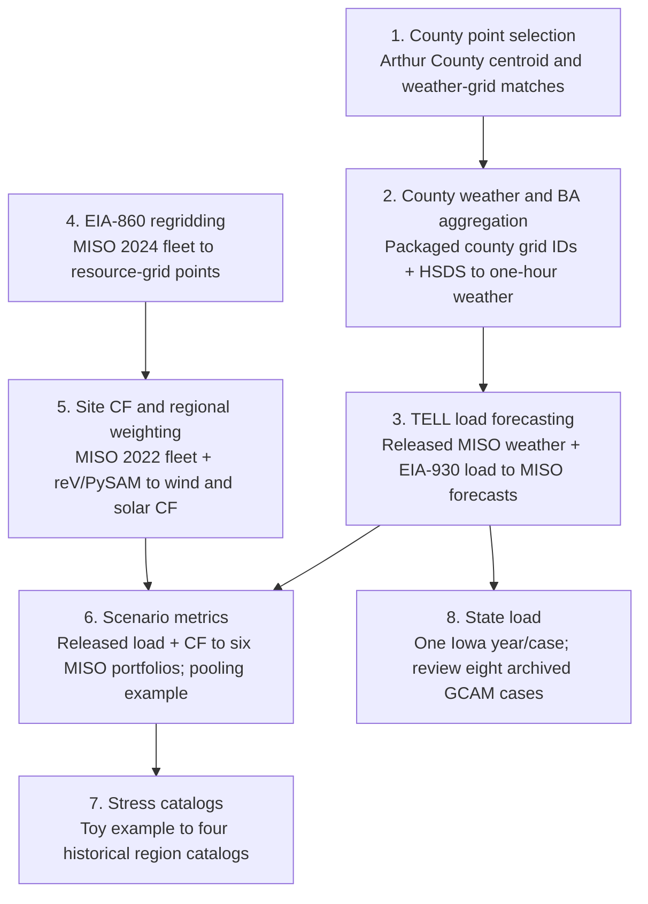

# Data-flow notebooks

These eight notebooks explain the construction methods through worked examples.
They follow the review order below, with separate load and renewable branches.
Each notebook reads its documented inputs directly. The examples do not
regenerate every product in the release, and their output files are not an
execution prerequisite for the next notebook.

Arrows show method relationships. Full state weather, CF, scenario-metric, and
catalog products are supplied in the release; the state appendices illustrate
parts of their construction. The [input/output guide](../../documentation/NOTEBOOK_INPUTS.md)
lists exact input families and local artifacts. The
[BA coverage guide](../../documentation/BA_COVERAGE.md) explains the different
entity sets, fleets, and calendars.

## 1. County weather-point selection

[`county_weather_point_selection.ipynb`](county_weather_point_selection.ipynb)

Two compact Arthur County CSVs provide 2020 Census block population (`POP100`)
and TIGER/Line block internal points. The notebook joins them, calculates the
population-weighted county centroid, and uses HSDS grid metadata to find the
nearest WTK, BC-HRRR, and NSRDB points. Results are displayed inline. The national
`county_centroid_regrid.csv` used in Step 2 is a packaged input; it is not
created by this single-county example.

## 2. County HSDS download and BA weather aggregation

[`county_hsds_download_and_ba_weather_aggregation.ipynb`](county_hsds_download_and_ba_weather_aggregation.ipynb)

The packaged county-grid crosswalk, BA/county service territories, and population
weights select and aggregate HSDS weather. The example stages one hour of
county weather in reusable HDF5 caches, then writes one hour of MISO weather.
Its columns are `time_utc`, `temperature_2m`, `specifichumidity_2m`,
`windspeed_10m`, `ghi`, `relativehumidity_2m`, and `pressure_0m`.
An appendix displays the analogous Iowa calculation. The full-period weather
used by Step 3 comes from Zenodo.

## 3. TELL load-forecast data flow

[`tell_load_forecast_data_flow.ipynb`](tell_load_forecast_data_flow.ipynb)

Released MISO weather, raw EIA-930 load, BA metadata, and documented source
periods form the inputs. The notebook cleans missing, nonpositive, and same-hour
outlier loads; builds weather/calendar predictors; tunes and trains a TELL
model; and predicts MISO load for 2007-2023. It compares held-out 2023 forecasts
with cleaned actual load. Outputs include TELL staging/model files, the
reconstructed forecast, validation rows, and two diagnostic figures.

## 4. EIA-860 renewable-site regridding

[`eia860_regridding_methodology.ipynb`](eia860_regridding_methodology.ipynb)

EIA-860 2024 plant and operable-generator workbooks identify onshore-wind and PV
sites. The notebook joins plant locations to generators, combines sites sharing
a technology and location, and finds their nearest WTK, BC-HRRR, or NSRDB grid
points through HSDS. It writes one MISO grid-point CSV. The appendix uses the
packaged mapping workbook and subregion point example to explain MISO
assignments. This example does not regrid every BA or the Sup3rCC grid.

## 5. Site capacity factors, weighting, and validation

[`site_cf_generation_ba_weighting_validation.ipynb`](site_cf_generation_ba_weighting_validation.ipynb)

This example uses the separate **2022 MISO fleet**, its packaged grid points,
SAM parameters, site weather from HSDS, and 2023 EIA-930 renewable actuals.
reV/PySAM creates site CF profiles; nameplate capacity weights those profiles
into MISO CF. The notebook compares generation against observed wind and solar
under no-loss and scalar-loss sensitivities. Outputs include weather/CF caches,
weighted MISO CF, metrics, and a figure. The Iowa appendix demonstrates the
MISO-contributed subset, not a complete state reconstruction. The released
historical scenarios use the 2024 fleet described in the coverage guide.

## 6. BA scenario-metrics generation

[`ba_scenario_metrics_generation.ipynb`](ba_scenario_metrics_generation.ipynb)

The notebook reads released historical load, wind/solar CF, scenario metrics,
and pooled metrics. It aligns UTC hours, applies technology-specific losses,
and evaluates the installed mix plus five wind/solar nameplate splits. Adjusted
CF times assigned capacity gives generation MW; subtracting wind and solar
generation from load gives net load. It writes a reconstructed MISO scenario
CSV and figure, compares results numerically with the release, and demonstrates
member aggregation for a pooled region. A separate observed-generation check
uses the 2022 validation capacity manifest and compact actuals.

## 7. BA and pooled-region stress-event catalogs

[`ba_stress_event_catalog.ipynb`](ba_stress_event_catalog.ipynb)

A toy example introduces thresholds, qualifying hours, and event grouping;
the same method is then applied to released scenario metrics for four example
regions using the BA and pooled manifests. Load/net-load cutoffs use pooled
90th, 95th, and 99th percentiles; renewable-equivalent CF uses absolute 10%, 5%,
and 1% cutoffs. Risk runs separated by one non-risk hour are bridged, and the
intervening hour is recorded in `gap_hours`. The notebook writes four event
CSVs. It demonstrates the method without regenerating all deposited catalogs
or asserting equality with every archived event file. Deposited state catalogs
use raw state load/net load rather than the GCAM-scaled columns.

## 8. State load generation

[`state_load_generation.ipynb`](state_load_generation.ipynb)

The notebook reads released TaiESM1 load for BAs serving Iowa, county service
territories, fixed 2020 population weights, and eight GCAM-USA demand scenarios.
It expands `county_populations_2000_to_2020.csv`'s `pop_2020` column into the
annual input format expected by TELL, allocates BA load to counties, and
reconstructs **one Iowa year and one GCAM case**. A separate section reads
archived Iowa load to plot all eight GCAM cases over 2000-2099. The full-period
figure is a review of released results, not an eight-case reconstruction in
this notebook.

## Execution and output boundary

Saved tables and figures support review on GitHub. Compact direct inputs are
under [`../../data/`](../../data/), and full analysis-ready products come from
[Zenodo](https://doi.org/10.5281/zenodo.21844870). Notebook artifacts and caches
are written under ignored `notebook_outputs/data_flow/<notebook-stem>/`.
Acquisition steps need HSDS access when caches are absent, and reconstruction
steps need the named TELL/reV/PySAM dependencies. Each notebook's execution note
identifies any saved acquisition outputs retained without a fresh service run.
