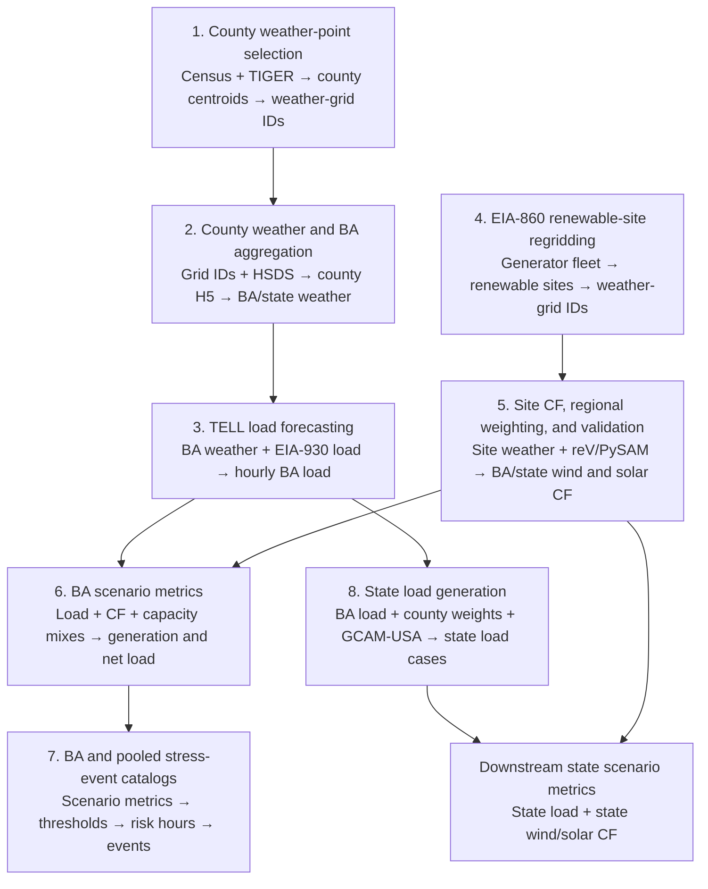

# Data-flow notebooks

These eight notebooks document how the weather, load, renewable-capacity-factor,
scenario-metric, and stress-event products are constructed. They are listed in
the recommended review order below.

The sequence contains two main branches:

- Steps 1–3 convert population and weather data into balancing-authority (BA)
  weather and hourly BA load.
- Steps 4–5 convert EIA-860 renewable-generator records and gridded resource
  data into BA and state wind and solar capacity factors.
- Step 6 joins BA load with wind and solar capacity factors to calculate six
  synchronized capacity-mix scenarios.
- Step 7 converts those scenario metrics into risk hours and stress events.
- Step 8 extends the load branch to state-level raw and GCAM-scaled load. Those
  state load series are combined downstream with state capacity factors using
  the same scenario equations demonstrated in Step 6.

## 1. County weather-point selection

[`county_weather_point_selection.ipynb`](https://github.com/charliephillips4201/wxdata-notebooks/blob/main/notebooks/data_flow/county_weather_point_selection.ipynb)

This notebook establishes the spatial link between counties and gridded weather
datasets.

- **Inputs:** 2020 Census block population (`POP100`), TIGER/Line block internal
  points, and WTK, BC-HRRR, and NSRDB grid coordinates accessed through HSDS.
- **Transformation:** It calculates a population-weighted latitude and longitude
  for each county, then uses nearest-neighbor matching to select one grid ID
  (`gid`) for each county and weather source.
- **Output:** A county-to-weather-grid crosswalk represented by
  `county_centroid_regrid.csv`.
- **Handoff:** Step 2 uses the selected `gid` values to retrieve weather time
  series.

## 2. County HSDS download and BA weather aggregation

[`county_hsds_download_and_ba_weather_aggregation.ipynb`](https://github.com/charliephillips4201/wxdata-notebooks/blob/main/notebooks/data_flow/county_hsds_download_and_ba_weather_aggregation.ipynb)

This notebook converts the spatial crosswalk into hourly regional weather.

- **Inputs:** County weather-grid IDs from Step 1, NREL weather variables read
  through HSDS, BA service-territory counties, and county populations.
- **Transformation:** It downloads weather at the selected county grid points,
  stages the results in reusable county-weather H5 files, and population-weights
  county values within each BA. When multiple weather sources are used, their
  aligned variables are merged on `time_utc`.
- **Output:** BA weather with the native schema `time_utc`, `temperature_2m`,
  `specifichumidity_2m`, `windspeed_10m`, `ghi`, `relativehumidity_2m`, and
  `pressure_0m`.
- **Extension:** The appendix applies the same population-weighting method to
  states instead of BAs.
- **Handoff:** Step 3 uses BA weather as the predictor input for TELL.

## 3. TELL load-forecast data flow

[`tell_load_forecast_data_flow.ipynb`](https://github.com/charliephillips4201/wxdata-notebooks/blob/main/notebooks/data_flow/tell_load_forecast_data_flow.ipynb)

This notebook demonstrates the complete BA load-modeling workflow with MISO as
the worked example.

- **Inputs:** BA weather from Step 2, EIA-930 hourly actual load, BA metadata,
  calendar variables, and the documented weather-source periods.
- **Transformation:** It cleans missing, nonpositive, and same-hour outlier load;
  constructs weather and calendar predictors; calibrates candidate TELL
  multilayer-perceptron models; trains the selected model; and predicts hourly
  load for 2007–2023.
- **Validation:** The held-out 2023 forecast is compared with cleaned EIA-930
  actual load using error metrics, a scatter plot, and a January time series.
- **Output:** A continuous hourly BA load series aligned to the BA weather
  timestamps.
- **Handoff:** BA load joins the renewable-capacity-factor branch in Step 6 and
  supplies the regional load inputs used by the state workflow in Step 8.

## 4. EIA-860 renewable-site regridding

[`eia860_regridding_methodology.ipynb`](https://github.com/charliephillips4201/wxdata-notebooks/blob/main/notebooks/data_flow/eia860_regridding_methodology.ipynb)

This notebook establishes the spatial and capacity link between renewable
generators and gridded resource datasets.

- **Inputs:** EIA-860 plant and operable-generator workbooks plus WTK,
  BC-HRRR, NSRDB, and Sup3rCC grid metadata.
- **Transformation:** It merges plant fields onto generator records, filters to
  wind and solar, aggregates generators sharing a technology and location, maps
  each renewable site to the nearest weather-resource `gid`, and sums nameplate
  capacity when multiple sites map to the same grid point.
- **Output:** Technology- and weather-source-specific site tables containing
  grid IDs, coordinates, and installed nameplate capacity.
- **MISO detail:** The appendix documents how total-MISO sites are assigned to
  MISO subregions before regional weighting.
- **Handoff:** Step 5 downloads site weather and converts it to capacity factors.

## 5. Site capacity-factor generation, regional weighting, and validation

[`site_cf_generation_ba_weighting_validation.ipynb`](https://github.com/charliephillips4201/wxdata-notebooks/blob/main/notebooks/data_flow/site_cf_generation_ba_weighting_validation.ipynb)

This notebook converts renewable-resource weather into regional wind and solar
capacity factors.

- **Inputs:** Regridded renewable sites from Step 4, site-level weather from
  HSDS, SAM model parameters, EIA-860 nameplate capacities, and EIA-930 observed
  wind and solar generation.
- **Transformation:** It runs reV/PySAM for every site, creates hourly site
  capacity-factor profiles, and calculates regional capacity factors as the
  nameplate-weighted average of the site profiles.
- **Validation:** MISO capacity factors are converted to modeled generation MW
  and compared with 2023 EIA-930 observations under no-loss and scalar-loss
  sensitivity cases.
- **Output:** Hourly BA wind and solar capacity factors. The appendix demonstrates
  the same calculation for the MISO-contributed Iowa subset and explains the
  full state aggregation.
- **Handoff:** Step 6 combines regional capacity factors with regional load.

## 6. BA scenario-metrics generation

[`ba_scenario_metrics_generation.ipynb`](https://github.com/charliephillips4201/wxdata-notebooks/blob/main/notebooks/data_flow/ba_scenario_metrics_generation.ipynb)

This notebook synchronizes the load and renewable branches and calculates the
hourly planning variables used by the analysis.

- **Inputs:** Hourly BA load from Step 3, wind and solar capacity factors from
  Step 5, installed renewable capacities, and technology-specific loss
  assumptions.
- **Transformation:** It aligns all three hourly series on `time_utc`, applies
  renewable losses, and evaluates six wind/solar nameplate-capacity portfolios:
  the installed mix plus 100/0, 75/25, 50/50, 25/75, and 0/100 wind/solar.
- **Core equations:** Adjusted capacity factor is multiplied by assigned
  nameplate capacity to obtain generation MW; wind and solar generation are
  subtracted from load to obtain net load.
- **Output:** Hourly load, wind generation, solar generation, net load, and
  renewable-equivalent capacity factor for every scenario.
- **Pooling:** A proof of concept shows how member-BA values are combined into a
  copper-plate pooled region.
- **Handoff:** Step 7 converts the complete BA and pooled scenario-metric files
  into stress-event catalogs.

## 7. BA and pooled-region stress-event catalog

[`ba_stress_event_catalog.ipynb`](https://github.com/charliephillips4201/wxdata-notebooks/blob/main/notebooks/data_flow/ba_stress_event_catalog.ipynb)

This notebook turns hourly scenario metrics into reviewable stress periods.

- **Inputs:** Historical BA and pooled-region scenario metrics from Step 6 plus
  the BA and pooled metadata manifests.
- **Transformation:** It reshapes the scenario metrics into an event table,
  calculates quantile ranks, applies stress thresholds, identifies qualifying
  risk hours, and groups adjacent hours into events. Risk runs separated by one
  non-risk hour are bridged, with the intervening hour recorded in `gap_hours`.
- **Thresholds:** Load and net load use pooled 90th, 95th, and 99th percentiles;
  renewable-equivalent capacity factor uses common absolute thresholds of 10%,
  5%, and 1%.
- **Output:** BA and pooled-region stress-event catalogs with event timing,
  duration, severity, scenario, metric, threshold, and gap information.
- **State note:** Deposited state catalogs use raw state load and net load so the
  event definition retains hourly climate variability without normalizing away
  GCAM-driven long-term growth.

## 8. State load generation

[`state_load_generation.ipynb`](https://github.com/charliephillips4201/wxdata-notebooks/blob/main/notebooks/data_flow/state_load_generation.ipynb)

This notebook extends the BA load workflow to state-level hourly demand, using
Iowa as the worked example.

- **Inputs:** Hourly load for the BAs serving Iowa, BA-to-county service
  territories, fixed 2020 county population, and eight GCAM-USA electricity
  demand trajectories.
- **Transformation:** It stages TELL-compatible inputs, allocates each BA's load
  to its counties using population shares, aggregates the Iowa counties, and
  applies GCAM-USA annual scaling factors.
- **Output:** Raw Iowa hourly load and eight GCAM-scaled load cases for 2000–2099.
- **Handoff:** The state load columns combine with state wind and solar capacity
  factors using the six portfolio equations demonstrated in Step 6. The
  resulting state scenario metrics support state risk-hour and stress-event
  analyses.

## Data and output boundary

The notebooks are committed with their executed outputs so tables and figures
render directly on GitHub. Their compact direct inputs are under
[`../../data/`](../../data/), and the large analysis-ready datasets are
distributed through Zenodo DOI
[10.5281/zenodo.21844870](https://doi.org/10.5281/zenodo.21844870).

Notebook-generated files and acquisition caches are written under the ignored
`notebook_outputs/` directory. They are not committed to GitHub and are not
included in the Zenodo data package.
